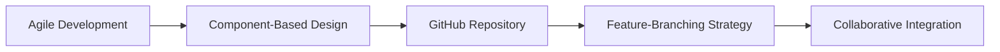

# 🧠 FeelsFIX

**Bridging the Gap Between Mental Health Professionals and Clients**

---

## 📖 About The Project

FeelsFix is an innovative online therapy booking system developed as a second year project at the **Sri Lanka Institute of Information Technology (SLIIT)**. The platform serves as a comprehensive digital solution that revolutionizes the traditional approach to mental health services by providing a centralized, efficient, and user-friendly system.

Our mission is to address the challenges of conventional, manual appointment systems while offering a streamlined approach to managing therapy sessions, payments, and client-therapist communication in the digital age.

---

## ✨ Key Features and Functionality

🔍 Click to explore our comprehensive feature set

### 👥 Multi-Role Architecture
The system is thoughtfully designed with a multi-role architecture, catering to:
- **Clients** - Seamless booking and management experience
- **Therapists** - Professional tools for practice management  
- **Administrators** - Complete system oversight and control

### 🛡️ User Management
- **Robust Registration System**: Secure user onboarding process
- **Advanced Authentication**: Multi-layer security protocols
- **Role-Based Access Control**: Personalized experiences based on user roles
- **Secure User Sessions**: Protected and encrypted user data

### 📅 Appointment Management
- **Flexible Scheduling**: Easy appointment booking system
- **Smart Rescheduling**: Hassle-free appointment modifications
- **One-Click Cancellation**: Simple cancellation process
- **Automated Reminders**: Reduce no-shows with intelligent notifications
- **Efficiency Optimization**: Streamlined workflow for maximum productivity

### 💳 Payment Management
- **Secure Transactions**: Industry-standard payment security
- **Automated Invoicing**: Professional invoice generation
- **Payment History Tracking**: Complete financial transparency
- **Refund Management**: Streamlined refund processing system

### 🎯 Workshop Management
- **Group Therapy Sessions**: Scalable group session organization
- **Wide Reach Capability**: Connect with broader audiences
- **Interactive Workshop Tools**: Enhanced engagement features
- **Session Management**: Complete workshop lifecycle management

### 📝 Content and Feedback System
- **Wellness Content Sharing**: Therapist-curated valuable resources
- **Client Feedback Platform**: Comprehensive rating and review system
- **Community-Driven Environment**: Foster collaborative wellness community
- **Quality Assurance**: Continuous improvement through user feedback

---

## 🛠️ Technical Stack and Methodology

### 🏗️ **MERN Stack Architecture**

| Technology | Purpose | Description |
|------------|---------|-------------|
|  | **Database** | NoSQL database for comprehensive application data storage |
|  | **Backend Framework** | Web application framework for building robust RESTful APIs |
|  | **Frontend Library** | JavaScript library for building dynamic user interfaces |
|  | **Runtime Environment** | JavaScript runtime environment for backend operations |

---

### 🚀 Development Methodology

- **📋 Agile Software Development**: Iterative and incremental development approach
- **🧩 Component-Based Design**: Modular and reusable code architecture
- **🔄 GitHub Repository Management**: Version control and collaborative development
- **🌿 Feature-Branching Strategy**: Efficient code integration and deployment
- **🤝 Collaborative Workflow**: Team-based development environment

---

## 🎯 Project Objectives

| 🎯 **Primary Goals** |
|---------------------|
| Bridge the gap between mental health professionals and clients |
| Provide a centralized digital solution for therapy management |
| Streamline appointment booking and management processes |
| Enhance client-therapist communication channels |
| Modernize traditional manual appointment systems |

---

## 🏛️ Academic Information

**🎓 Second Year Project**  
**🏢 Sri Lanka Institute of Information Technology (SLIIT)**

*Developed as part of the second year academic curriculum to demonstrate foundational application development skills and contribute to the mental health technology landscape.*

---

## 📞 Support & Contact

For any questions, suggestions, or support regarding FeelsFIX, please feel free to reach out:

---

**Made with ❤️ for Mental Health**

*Empowering mental wellness through technology*

---

⭐ **Star this repository if you found it helpful!** ⭐

